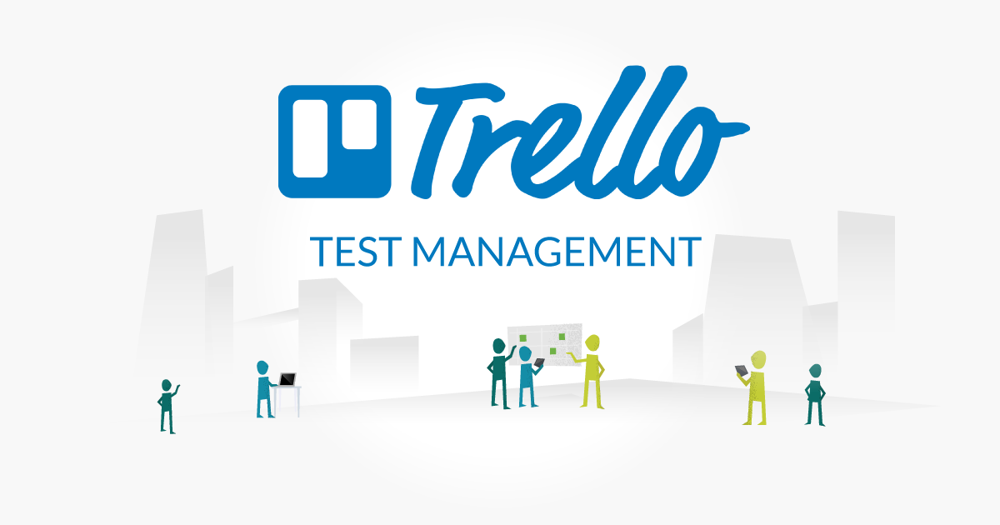

# 📑 Trello Automation Project



## 📌 Project Overview
This project is a comprehensive automation suite for Trello, designed to validate both its UI and API functionalities. By utilizing industry-standard tools, the suite ensures the stability and performance of Trello's essential features.

## 🔑 Features
- **UI Automation**: Leveraging Selenium WebDriver to automate Trello’s user interface.
- **API Testing**: Testing key Trello API endpoints using the Requests library.
- **Integrated Reporting**: Detailed test reports generated through the Allure framework.
- **Jira Integration**: Seamless test management via Jira.

## 🎯 Test Scope
- **UI Tests**: Verifying core functionalities of Trello’s user interface.
- **API Tests**: Validating critical endpoints of the Trello API.
- **Combined Tests**: Demonstrating UI and API integration through combined test cases.

## 🛠️ Setup Instructions

 **Clone the Repository**:
```bash
git clone https://github.com/imad-Ra/Trello_Final_Project.git
cd Trello_Final_Project
```
   
**Install Dependencies**:

```bash
pip install -r requirements.txt
```

Configure Environment Variables:
    
```bash
cp .env.example .env
```
 **Edit .env to include your Trello API key and token**
## ▶️ Running Tests
UI Tests:

```bash
pytest test/web
```
API Tests:

```bash
pytest api/tests
```

Run All Tests with Allure Reporting:

```bash
pytest --alluredir=./reports
allure serve reports
```
## 🛠️ Tools and Technologies
- **IDE**: PyCharm 2024.1.1
- **Automation Framework**: Selenium 4.22.0
- **Programming Language**: Python 3.8+
- **Browser**: Google Chrome 126.0.6478.127
- **API Testing**: Requests library
- **Test Framework**: Pytest
- **Reporting**: Allure Framework
- **Version Control**: Git
- **Bug Tracking**: Jira

## 📊 Allure Reporting

**To use Allure reporting**:

Install Allure:

```bash
npm install -g allure-commandline
```

Run Tests and Serve Report:

```bash
pytest --alluredir=./reports
```

```bash
allure serve reports
```

## 🔗 API Reference
This project utilizes the official Trello REST API. For detailed API documentation, refer to:
[Trello REST API Documentation](https://developer.atlassian.com/cloud/trello/rest/api-group-applications/#api-group-applications)

Our test suite covers key endpoints from this API, ensuring comprehensive validation of Trello's functionality.

## 📘 Documentation
In addition to the code, this project includes:
* Software Test Plan (STP): Detailed testing strategy and approach
* Detailed test cases documented in Word (STD file)
* Postman collections for API testing 
* Comprehensive README for project overview and setup instructions


## 🙏 Acknowledgements
* Trello API
* Selenium
* Pytest
* Allure Framework
* Jira


## 🤝 Contributing
We welcome contributions! Follow these steps:

Fork the repository.
Create a feature branch:
``` git checkout -b feature/NewFeature.```

Commit your changes:
```git commit -am 'Add NewFeature'.```

Push to the branch:
```git push origin feature/NewFeature.```

Submit a pull request.
## 📞 Contact
For questions or suggestions, feel free to reach out:

- **Name**: Imad Rabah
- **Email**: imadrabah123@gmail.com
- **GitHub**: ImadRabah [https://github.com/imad-Ra]


 